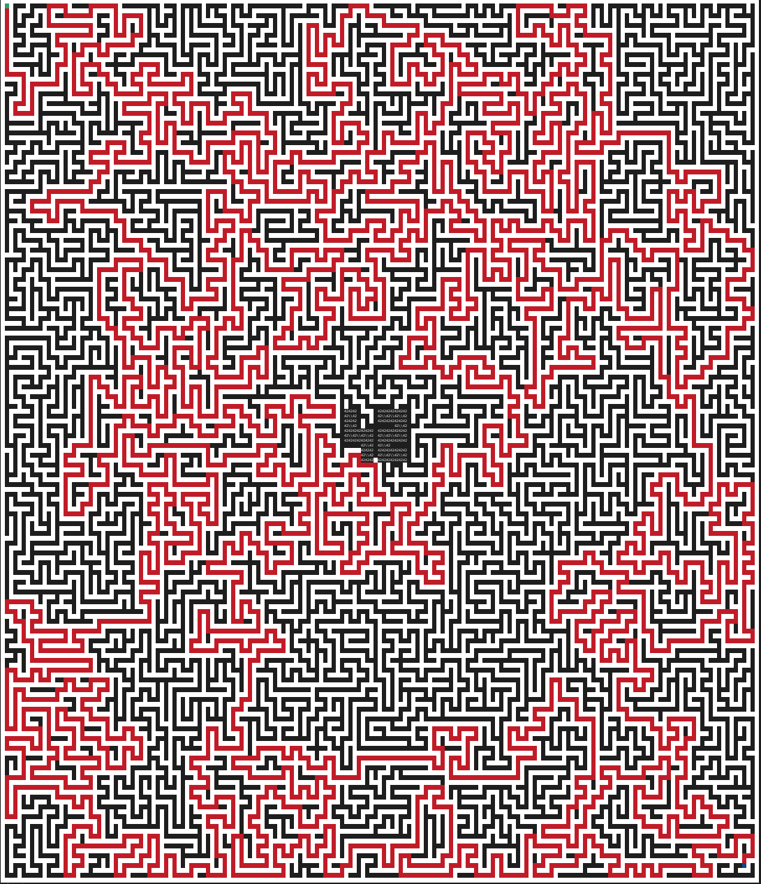

_This project has been created as part of the 42 curriculum by ktomita, tatsuzuk._

# A-maze-ing

<center></center>

## Description

### 課題の概要

設定ファイルを受け取り迷路を生成し、ユーザーインタラクティブなプログラムをPythonで実装しました。また生成された迷路の情報を出力ファイルに書き込みました。

### 設定ファイルのフォーマット

| Key         | Description                                       | Example                |
| ----------- | ------------------------------------------------- | ---------------------- |
| WIDTH       | 迷路の横幅                                        | `WIDTH=20`             |
| HEIGHT      | 迷路の縦幅                                        | `HEIGHT=15`            |
| ENTRY       | 入口の座標 (x,y)                                  | `ENTRY=0,0`            |
| EXIT        | 出口の座標 (x,y)                                  | `EXIT=19,14`           |
| OUTPUT_FILE | 出力ファイル名                                    | `OUTPUT_FILE=maze.txt` |
| PERFECT     | 完全迷路か？                                      | `PERFECT=True`         |
| seed        | 迷路のシード値（シード値によって迷路が決まる） 　 | `seed=42`              |

`#`から始まる行はコメントとして扱われ無視されます。

#### 例:

```
WIDTH=11
HEIGHT=11
ENTRY=0,0
EXIT=10,10
PERFECT=True
OUTPUT_FILE=maze.txt
seed=42
```

### 出力ファイルのフォーマット

各セルは **1桁の16進数** で表され、どの壁が閉じているかをビットで表します。

| ビット位置             | 方角       |
| ---------------------- | ---------- |
| ビット0 - 最下位ビット | 北 (North) |
| ビット1                | 東 (East)  |
| ビット2                | 南 (South) |
| ビット3                | 西 (West)  |

- 壁が閉じている → ビットを **1**
- 壁が開いている → ビットを **0**

### 例

- `3` 2進数で `0011`→ 南・西の壁が開いていて、北・東は閉じている
- `A` 2進数で `1010`→ 東・西の壁が閉じている、北・南は開いている

#### フォーマット

1. **迷路本体**
   - セルを行ごとに、1行1行として出力
   - 各行の各文字が1マスに対応する16進数

2. **空行**
   - 迷路本体の後に1行空ける

3. **メタ情報（3行）**
   - 1行目: 入口座標（entry）
   - 2行目: 出口座標（exit）
   - 3行目: 入口から出口までの最短経路（`N`・`E`・`S`・`W` の4文字で表現）

例:

```
b97
ac3
c56

0,0
2,2
SSSSEEEE
```

---

## Instructions

### 必要環境

- Python 3.10 以上
- [uv](https://docs.astral.sh/uv/): パッケージ管理・実行環境

### セットアップと実行

```
make install   # uv syncコマンドによる依存関係のインストール
make run       # config.txt を使って迷路生成・表示 (python3 a_maze_ing.py config.txt)
```

`config.txt` 以外の設定ファイルを使う場合は `CONFIG` 変数を指定します。

```
make run CONFIG=myconfig.txt
```

`make` を使わず直接実行する場合は以下の通りです。

```
uv run python3 a_maze_ing.py config.txt
```

実行すると迷路が生成されターミナルに表示され、続けて `OUTPUT_FILE` で指定したファイルへ書き出されます。その後、以下の操作を番号で選択できます。

```
1. Re-generate a new maze     # 新しい迷路を再生成して表示
2. Show / Hide the shortest path  # 最短経路の表示・非表示を切り替え
3. Rotate the wall colours    # 壁の色を変更
4. Quit                       # 終了
```

### その他のMakeターゲット

| ターゲット         | 内容                                                    |
| ------------------ | ------------------------------------------------------- |
| `make install`     | 依存関係のインストール                                  |
| `make run`         | 迷路の生成・表示の実行                                  |
| `make debug`       | `pdb` によるデバッグ実行                                |
| `make test`        | `pytest` によるテスト実行                               |
| `make lint`        | `flake8` と `mypy` によるチェック                       |
| `make lint-strict` | `mypy --strict` を含む、より厳格なチェック              |
| `make build`       | 再利用可能な `.whl` 形式の `mazegen` パッケージのビルド |
| `make clean`       | `__pycache__` などキャッシュの削除                      |
| `make fclean`      | `clean` に加え `.venv` や`maze.txt` 等の生成物も削除    |

---

## Resources

### Websites

以下のWebサイトを参考にしました。

#### Pythonの仕様など

- [Python 3.14.7 Documentation](https://docs.python.org/3/index.html)
- [Pythonのメモリ管理: ガベージコレクション、弱参照、循環参照の問題と解決策 #Python - Qiita](https://qiita.com/Tadataka_Takahashi/items/a5d9654bba38d4eb3686)
- [【Python】抽象クラス・基底クラス・抽象基底クラスの違いをわかりやすく解説！ - IT Information](https://it-infomation.com/python-base-class-abstract-class-abstract-base-class/)
- [printで色をつける方法 | Python学習講座](https://www.python.ambitious-engineer.com/archives/3721)

#### 迷路生成アルゴリズム

- [13 Maze Generation Algorithms Visualized (with Sound) | 迷路生成アルゴリズム全13種を見比べる - YouTube](https://www.youtube.com/watch?v=Y6Ijgl0iZb0)
- [自動生成迷路](https://www5d.biglobe.ne.jp/stssk/maze/make.html)
- [ランダムに迷路生成したい［棒倒し法］｜つけらっとゲームス](https://note.com/tsukerat_games/n/nfd7ae53371ae)
- [【よくわかる】迷路生成アルゴリズム「棒倒し法」を説明！](https://minatame-lab.com/maze-stick/)
- [迷路作成アルゴリズムまとめ](https://zenn.dev/megeton/articles/5b16208f5d9678)
- [C言語：棒倒し法でダンジョン(迷路)を表現する | 電脳産物](https://dianxnao.com/c%E8%A8%80%E8%AA%9E%EF%BC%9A%E6%A3%92%E5%80%92%E3%81%97%E6%B3%95%E3%81%A7%E3%83%80%E3%83%B3%E3%82%B8%E3%83%A7%E3%83%B3%E8%BF%B7%E8%B7%AF%E3%82%92%E8%A1%A8%E7%8F%BE%E3%81%99%E3%82%8B/)
- [穴掘り法を使って迷路を作ろう #Python - Qiita](https://qiita.com/naru_1017/items/e4d017433372a313aeb3)
- [迷路生成(穴掘り法) - Algoful](https://algoful.com/Archive/Algorithm/MazeDig)
- [ターミナルプロンプトの表示・色の変更 #Linux - Qiita](https://qiita.com/hmmrjn/items/60d2a64c9e5bf7c0fe60)
- [倒すって英語でなんて言うの？ - DMM英会話なんてuKnow?](https://eikaiwa.dmm.com/uknow/questions/59114/)
- [穴掘り法を使って迷路を作ろう #Python - Qiita](https://qiita.com/naru_1017/items/e4d017433372a313aeb3)
- [sazameki/maze-algorithms: 迷路生成の各種アルゴリズムのC++実装 (Win/Mac両対応)](https://github.com/sazameki/maze-algorithms)
- [【アルゴリズム】BFS(幅優先探索) #初心者 - Qiita](https://qiita.com/Taira0222/items/b3cf5927235fa5121fd7)

#### パッケージング・型チェック・Lint設定

- [2022年版pyproject.tomlを使ったPythonパッケージの作り方 - Qiita](https://qiita.com/ieiringoo/items/4bef4fc9975803b08671)
- [uv build と uv build --sdist --wheel は等価ではない](https://zenn.dev/himkt/articles/93787c26ddd1ef)
- [Build backend | uv](https://docs.astral.sh/uv/concepts/build-backend/)
- [Mypyのpyproject.toml設定オプション完全一覧（1.19.1） | Ruff & Mypy Practice Guide](https://zenn.dev/egg_glass/books/ruff-mypy-guide/viewer/mypy-pyproject-options)
- [flake8の設定ファイルは .flake8 に記述する](https://thaim-til.hatenablog.jp/entry/2023/11/20/234509)

### AI Usage

私たちはAIを以下の用途に利用しました。

- 検索
- トラブルシューティング
- Pull Requestやコミットメッセージの文章の生成
- README.mdの構成の整理・文章の推敲

私たちはGitHubのPull Requestの機能や、お互いのレビューやコミュニケーションを通じて常にコードについて議論しました。特に、今回の課題で重要となる迷路のアルゴリズムについてはすべて手動で書き、お互いに理解を深めるために時間をかけて話し合いました。

---

## Additions according to the subject

これらのこと以外に課題で追加で求められていることについて、以下に記します。

### Structure of the repository

```
.
├── a_maze_ing.py        # エントリーポイント (python3 a_maze_ing.py config.txt)
├── config.txt           # デフォルトの設定ファイル
├── Makefile
├── pyproject.toml
├── LICENSE.md
├── src/mazegen/         # 再利用可能な迷路生成パッケージ本体
│   ├── mazegen.py       # MazeGenerator クラス（生成・探索・表示）
│   ├── types.py         # Board / Coordinate / FillStatus などの型定義
│   ├── errors.py        # 独自例外
│   ├── parser/          # 設定ファイルのパースとバリデーション (Config)
│   ├── visualizer/      # ターミナルでのインタラクティブUI
│   └── README.md        # mazegenモジュール単体の使い方
├── tests/               # pytest によるテスト（設定ファイルのパース周り）
└── README.md
```

### Algorithm Choice

最初は**棒倒し法**で迷路生成を実装していました。しかし盤面の中央に「42」のパターンを配置しようとしたとき、棒倒し法では生成できるマスの形に制限があり、42パターンと矛盾なく生成することができませんでした。そのため最終的に**穴掘り法**で迷路を生成する方式に変更しました。

- `PERFECT=True` の場合は、穴掘り法で生成した完全迷路（ループなし、入口〜出口は必ず1本道）をそのまま出力します。
- `PERFECT=False`（デフォルト）の場合は、完全迷路を生成したあとに `_braid` で行き止まりのセルの壁を一部取り除いてループ（複数経路）を作り、Pac-Manのように遊べる盤面にしています。
- 入口から出口までの最短経路は、生成後にBFS（`_solve_with_bfs`）で求めています。

#### Why?

穴掘り法は「道の候補となる場所を含めて壁で埋めた盤面から掘り進める」方式のため、あらかじめ42パターンの壁を固定してから掘り進めても隙間の通路も考慮した迷路生成ができます。一方、棒倒し法は「棒を倒して迷路を作る」方式で、42パターンと矛盾しないように棒を倒すことができず、Perfectな迷路がPerfectでなくなってしまい、今回の提出には含めませんでした。

#### BFS（幅優先探索）による最短経路の探索

BFS（Breadth-First Search / 幅優先探索）は、開始地点から近いノードの順に、キューを使って層（距離）ごとにグラフを探索していくアルゴリズムです。迷路の各セルをノード、壁のない隣接セルへの通路をエッジと見なすと、迷路探索はグラフ探索の問題として扱えます。

`_solve_with_bfs` では、入口のセルをキューに入れてスタートし、上下左右の壁がないセルへ1マスずつ探索を広げながら、各セルに「どのセルから来たか」（`prev_cordinate`）を記録しています。出口のセルに到達した時点でキューを打ち切り、`prev_cordinate` を出口から入口まで逆順に辿ることで最短経路の座標集合と、進んだ方向（`N`/`E`/`S`/`W`）の文字列を復元しています。

### Reuseability

`src/mazegen` は、迷路生成ロジックを独立した `MazeGenerator` という単一のクラスに、他プロジェクトからそのまま `import` して再利用できるようしたモジュールです。`make build` で `mazegen-*.whl` としてビルドでき、`pip` でインストールして使うことができます。設定ファイルのパース (`Config`)・迷路生成・最短経路探索(BFS)・ターミナル表示までがこの1パッケージに含まれているため、生成ロジックだけを取り出して別プロジェクトに組み込むことができます。

より詳しいAPIドキュメントは [`src/mazegen/README.md`](src/mazegen/README.md) にあります。以下に簡単な使い方を示します。

#### 基本的な使い方

```python
from mazegen import MazeGenerator, Config

config = Config.model_validate({
    "width": "15",
    "height": "15",
    "entry": "0,0",
    "exit": "14,14",
    "output_file": "maze.txt",
})

maze_gen = MazeGenerator(config)
maze_gen.generate_data()   # 迷路と最短経路を生成
maze_gen.print_board()     # ターミナルに盤面を出力
```

#### カスタムパラメータの指定

`Config` に盤面の幅 (`width`, `height`)、`seed`、完全迷路にするかどうか (`perfect`) などを渡すことで、生成される迷路をカスタマイズできます。

```python
config = Config.model_validate({
    "width": "21",
    "height": "21",
    "entry": "0,0",
    "exit": "20,20",
    "output_file": "maze.txt",
    "perfect": "True",
    "seed": "42",
})
maze_gen = MazeGenerator(config)
```

CLIから設定ファイル（`KEY=VALUE` 形式）を読み込んで `Config` を作りたい場合は、`arg_parse()`（`sys.argv` からファイルパスを受け取る）が使えます。

```python
from mazegen import arg_parse, MazeGenerator

config = arg_parse()
maze_gen = MazeGenerator(config)
```

#### 生成結果へのアクセス

`generate_data()` を呼んだ後、以下の属性から生成結果を参照できます。

- `maze_gen.board`: `list[list[FillStatus]]`。盤面全体。各セルは `mazegen.types.FillStatus`（`empty` / `wall` / `entry` / `exit` など）。
- `maze_gen.path`: `set[tuple[int, int]] | None`。入口から出口までの最短経路上の座標集合（**解答へのアクセス**。`board` 上の座標系、入口・出口自体は含まない）。
- `maze_gen.path_direction`: `str`。最短経路を入口から出口まで辿った移動方向を `N`/`S`/`E`/`W` で連結した文字列。

```python
maze_gen.generate_data()

print(maze_gen.path_direction)   # 例: "SSEENNSS..."
print(len(maze_gen.path))        # 経路長

# 盤面や座標、経路のデータをテキストとして出力ファイルに書き出す
maze_gen.generate_output()
```

### Team Management

2人で開発をしました。以下にそれぞれが中心的に担当したことと、2人で協力して行ったことを記します。

#### ktomita

- 穴掘り法と提出しなかった棒倒し法の迷路生成のアルゴリズムの作成
- 42を含めた / 含めない迷路の生成
- コードのリファクタリングや改善方法の提案

#### tatsuzuk

- Configのパースとエラーハンドリング、テスト
- 生成された迷路を解くアルゴリズムの作成
- 生成された迷路のファイルへの出力
- ターミナルへの出力の整形
- Makefileやpyproject.tomlなどの環境構築

#### 2人でやったこと

- データ構造や全体の設計の決定や計画
- 相互のコードのレビュー
- 例外ケースやエラーの発見
- アルゴリズムなどの理解

#### Planning

開発は大きく3つのフェーズに分けて進めました。詳細は [`PLAN.md`](PLAN.md) を参照してください。

1. **〜8/25（チーム作成以前） 環境構築・パーサー**: `uv` による環境構築、Makefileの整備、設定ファイルのパース処理を先に固める。
2. **8/25〜8/31 迷路生成**: 棒倒し法で迷路生成のベースラインを作成し、ターミナル出力・ファイル出力を実装。完了後にコードレビューとテストを行い、クラス構成を課題要件に合わせて整理。
3. **9/1〜9/4 42パターン・迷路の解答**: 42パターンを含めた迷路生成、および入口から出口までの最短経路を求めるアルゴリズムを追加。
4. **〜9/9 仕上げ**: `PERFECT=False` 用の非完全迷路（ループあり）生成アルゴリズムを追加し、全体の検証、ターミナルUIの整備、解答経路のファイル出力を行い提出に備えた。

当初は棒倒し法で迷路生成を進めていましたが、Phase 2で42パターンを組み込む際に前述の制約（[Algorithm Choice](#algorithm-choice) 参照）が見つかったため、穴掘り法へ方針転換しました。フェーズ分け自体の大枠は変更せず、アルゴリズムの実装方針のみを途中で見直す形で対応しました。

#### Things worked / Things can be improved

##### 良かった点

- アルゴリズムの変更などもあったが、コード全体の設計が整っていたため大きな影響もなくスムーズに実装を進められた。
- GitHubのPull Requestを使ったコードレビューを通じて、互いのコードの理解を深めることができた。
- 部分的ではあるが、Rebaseを用いてコミット履歴を整理することで、コミット履歴をきれいにすることができた。

##### 改善できる点

- テストは設定ファイルのパース部分 (`tests/`) にしか用意できておらず、迷路生成や探索ロジックのテストをしっかりと書き進めることができなかった。
- MLXによるグラフィカル表示やアニメーションなどのボーナス機能には手が回らなかった。
- Gitの扱いにもう少し一貫性を持たせても良かったと思った。

#### Used tools

- パッケージマネージャおよびPythonの実行環境の管理に `uv` を利用しました。
- 型チェックに `mypy`、コーディング規約のチェックに `flake8` を利用しました。
- 設定ファイルのバリデーションに `pydantic` を利用しました。
- テストには `pytest` を利用しました。
- お互いのコードレビューはGitHubのPull Requestなどの機能を活用して行いました。
